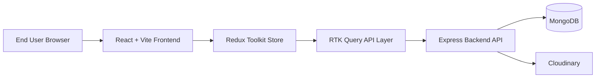
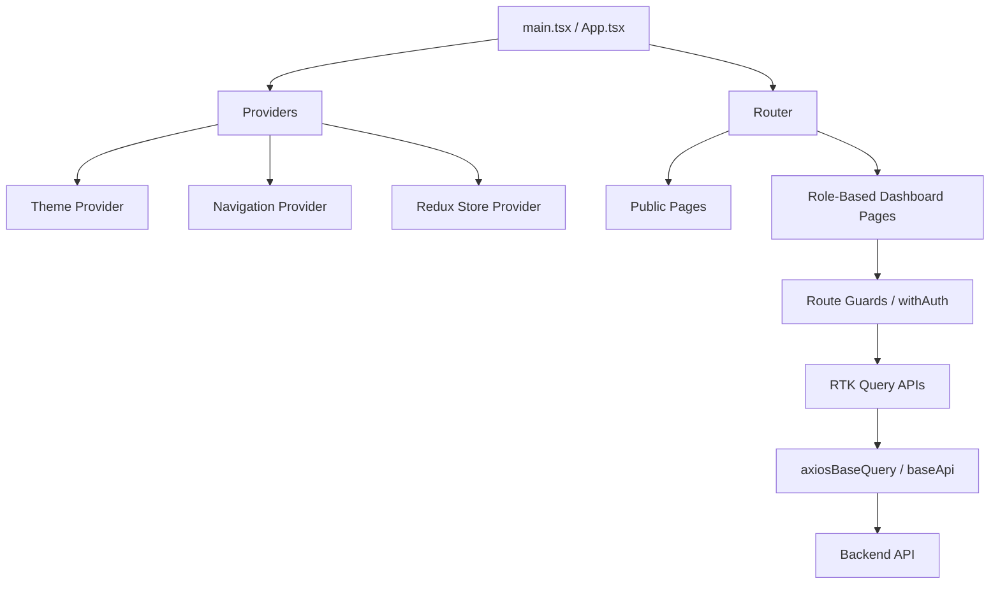
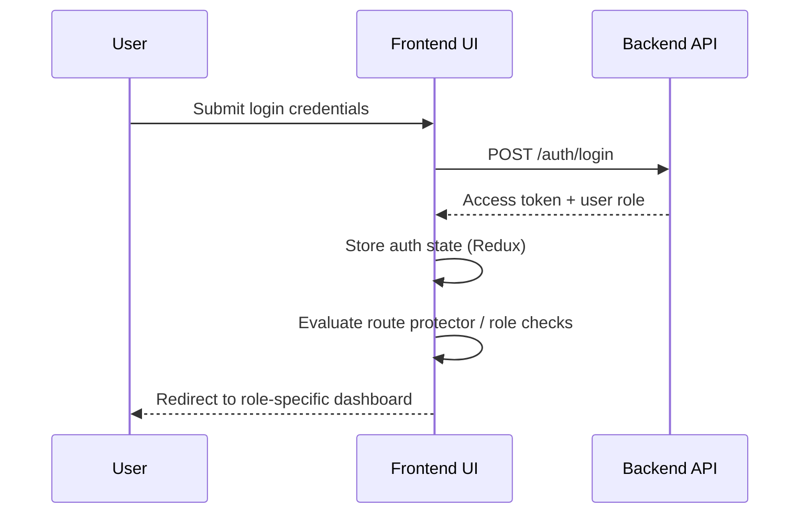
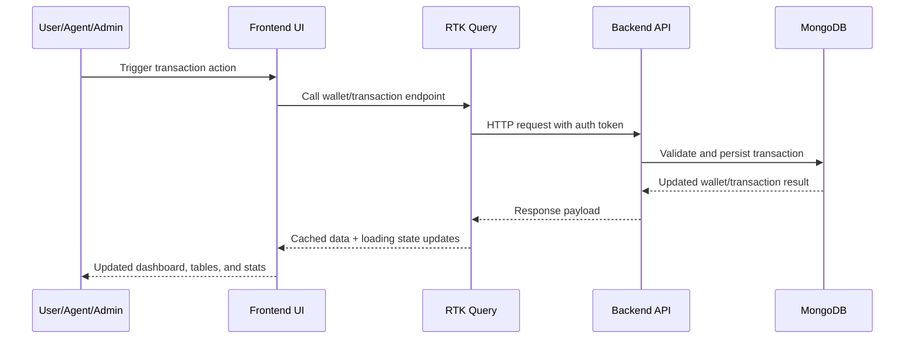
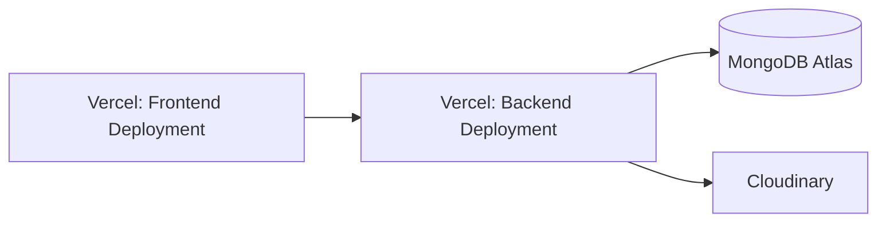

# System Architecture

This document describes the high-level architecture of the Digital Wallet Management System frontend and its integration with backend services.

## 1. High-Level Architecture

## 2. Frontend Internal Architecture

## 3. Authentication & Authorization Flow

## 4. Transaction Data Flow

## 5. Core Architectural Decisions

- Frontend state management uses Redux Toolkit with RTK Query for API caching and request lifecycle management.
- Route protection is role-aware to enforce dashboard and page access boundaries.
- Backend remains a separate deployment and is consumed through `VITE_API_URL`.
- Media and KYC/profile asset storage is delegated to Cloudinary.

## 6. Deployment View

